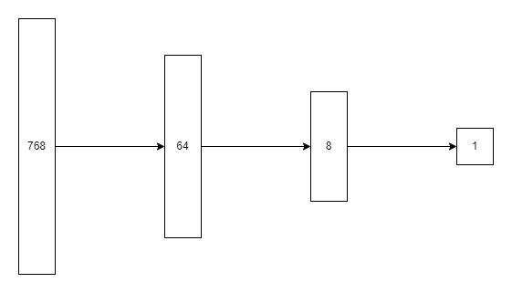

# NNUE

## Summary

This document contains general information about Pingu's NNUE.

The aim is to provide a broad summary of the process of switching from HCE (hand crafted evaluation) to NNUE (ƎUИИ - efficiently updatable neural network) evaluation.

What is covered:
- Model architecture
- Generating a self-play dataset
- Training the network
- Efficient implementation of NNUE

For code examples, please refer to:
- ```/tuning/``` for dataset and training code
- ```/include/nnue.h``` for model implementation

## Contents

- [Summary](#summary)
- [What is NNUE?](#what-is-nnue)
- [Model architecture](#model-architecture)
- [Dataset](#dataset)
- [Training](#training)
    - [Loss](#loss)
    - [Optimizer and hyperparameters](#optimizer-and-hyperparameters)
    - [Data processing](#data-processing)
    - [Large dataset](#large-dataset)
    - [Overall process](#overall-process)
- [Implementation](#implementation)
    - [Incremental updates](#incremental-updates)
    - [Quantization](#quantization)
    - [SIMD intrinsics](#simd-intrinsics)
- [Results](#results)

## What is NNUE?

NNUE is a neural network which is efficiently updated, providing a fast yet high-quality static evaluation.

The input layer does not change much on move make/unmake, allowing for efficient incremental updates of the first hidden layer.

## Model architecture

<div align="center">
    
</div>

Pingu's NNUE consists of linear (fully connected) layers.

The input layer encodes piece positions as follows:

```math
\text{input\_layer}[64 * i + j] = \left\lbrace \begin{array}{lr} 1, & \text{if piece i on square j} \\ 0, & \text{otherwise} \end{array} \right.
```

Activations of the hidden layers (64 and 8) are clipped ReLU, defined as

```math
\text{cReLU}(x) = \min(\max(x, 0), 1)
```

Linear activation is used for the output layer.

The clipped ReLU activation allows the network to learn non-linear relationships, and clipping the values in the range [0,1] limits the magnitude of intermediate values, which helps quantization into small integer types (e.g. int_16 or int_8).

## Dataset

For the first iteration of Pingu NNUE, the aim was to generate an evaluation stronger than HCE, whilst retaining the character of Pingu HCE. Therefore, the NNUE was trained to approximate the score of a fixed-depth Pingu HCE search.

This [dataset](https://www.kaggle.com/datasets/williamching/pingu-2-0-0-dataset) was used.

It contains ~93 million fen strings labelled with the white-relative score (centipawns) of a fixed-depth search using 256 MB hash.

All positions were generated from self-play games from Pingu 2.0.0.

__Key points:__
- __Search depth;__ a fixed depth of 8 or 10 was used. Depth > 0 ensures a score that is stronger than static evaluation. Most positions are depth 8 for speed of data generation but depth 10 is ok too.
- __Dataset variety;__ random moves were played for the first 4 or 6 ply to ensure dataset variety, and from then on the best moves from each search were played to ensure that realistic positions were reached.
- __Quiet positions;__ only positions where the best move was a non-capture were included in the dataset. This helps since the final NNUE is called in quiet positions after qSearch.
- __Game length;__ maximum game length was capped at 200 ply to prevent over-representation of drawn endgames in the dataset.

Future Pingu datasets may keep track of game results too.

## Training

PyTorch with GPU acceleration was used to train the model.

### Loss

The mean squared error of a sigmoid transformation was used to calculate loss.

```
def custom_loss(output, target):
    K = 0.00475
    output_scaled = torch.sigmoid(K*output)
    target_scaled = torch.sigmoid(K*target)
    return torch.mean((output_scaled - target_scaled)**2)
```

The value of K was chosen to be the same as that used for tuning Pingu's HCE.

The sigmoid transformation serves two purposes:
- __Dampen extreme eval;__ when the evaluation is equal, |output_scaled - target_scaled| is large. When the evaluation is large in magnitude, |output_scaled - target_scaled| is small. This is desirable since evaluation should be more sensitive in equal positions, whereas an obviously winning/losing position does not require such sensitivity.
- __Result compatibility;__ the sigmoid transformation maps evaluation to (0,1) interval which is compatible with WDL game results. If desired, the loss can be a linear combination of scaled eval and game result.

### Optimizer and hyperparameters

Adam optimizer was used with the default parameters.

A batch size of 1024 was used.

A 95:5 split of training:validation data was used, giving ~89 million training data and ~4.5 million validation data.

### Data processing

Before training, fen strings in the dataset were converted into sparse arrays representing the input vector.

The sparse arrays were 32-element arrays containing non-zero indices of each 768-element input vector (up to 32 pieces on board; if <32 pieces some indices are repeated which is ok).

These sparse arrays were transferred to the GPU, which converted them to dense 768-element vectors.

```Sparse (CPU/RAM) -> Sparse (GPU) -> Dense (GPU)```

### Large dataset

Since the training dataset was so large, it was pre-shuffled and divided into chunks (distinct contiguous subarrays of the dataset) before training and these chunks remained unchanged during training. Each chunk contained ~30 million samples.

Each chunk was loaded into RAM, and the chunk was randomly divided into mini-batches.

A numpy memmap was used to access the dataset to transfer a chunk to RAM.

While dividing the dataset into chunks slightly decreased the effectiveness of shuffling (data in separate chunks was not interchanged between epochs), it was much faster in terms of performance compared to the alternative method of creating batches directly from disk. When loading a chunk, numpy accesses a contiguous subarray once which is ok. In contrast, creating batches directly from disk requires many random accesses of the memmap which is slow.

### Overall process

Pre-processing:

```
- Fen strings -> Sparse arrays
- Shuffle dataset and split into chunks
```

Training loop per epoch:

```
Shuffle order of chunks

For each chunk:
    - Load chunk into RAM
    - Create batch of sparse arrays (random sample without replacement)
    For each batch:
        - Transfer batch of sparse arrays to GPU
        - Convert sparse arrays into dense inputs
        - Calculate error
        - Backpropagate

Calculate validation loss
```

The training process was terminated manually once the validation loss stopped decreasing and the model with the lowest validation loss was selected.

The current Pingu NNUE took 88 epochs to train.

## Implementation

After training, the NNUE was integrated with Pingu, fully replacing the HCE.

Listed below are some key optimizations that Pingu's NNUE benefits from.

### Incremental updates

The first hidden layer is incrementally updated. It is efficient because relatively few inputs change each time a piece is moved.

This requires that we track the values of the first hidden layer _before_ the clipped ReLU is applied, since clipped ReLU cannot be inverted outside the interval (0,1).

```
    Move make/unmake: 768 -> 64
    Static eval: 64 -> cReLU(64) -> 8 -> cReLU(8) -> 1
```

### Quantization

Pingu's NNUE stores its weight and bias values as integers, with appropriate scaling to maintain precision.

It is beneficial to quantize the floating point weights into integer domain for the following reasons:
- __Incremental updates;__ integer arithmetic is exact so we can perform incremental updates freely.
- __Speed;__ arithmetic with integers is faster than with floating point numbers.

Pingu quantizes the first layer and its weights to 16-bit integers. The second and output layers are quantized to 32-bit integers.

### SIMD intrinsics

Finally, SIMD intrinsics can be used to speed up matrix operations. Pingu uses AVX2 which makes use of 256 bit registers.

SIMD intrinsics are fastest when dealing with contiguous sections of memory, and for this reason the ```input_weights``` array in ```/include/nnue.h``` is stored as its transpose.

More aggressive quantization to smaller integer types would allow for faster SIMD execution, and future versions of Pingu will aim to do this.

## Results

Pingu NNUE was introduced in this [commit](https://github.com/WillChing01/Pingu/commit/390334f411030756d026f14faca2e773863fe28e), leading to gains of ~170 elo at short time controls against Pingu HCE.
