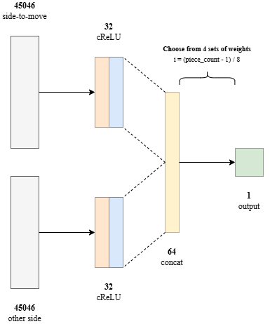

# NNUE 3

## Summary

This document contains information about Pingu's NNUE. It is the sequel to [nnue_2.md](/docs/nnue_2.md) and it describes the process of training the NNUE for [Pingu 5.0.0](https://github.com/WillChing01/Pingu/releases/tag/v5.0.0).

The transition from Pingu 4.0.0 to Pingu 5.0.0 involved training two successive models of increasing complexity, resulting in cumulative gains of ~170 Elo at short time controls. In addition to changes in model architecture, several large improvements were made to the machine learning pipeline, streamlining the process of data generation, preprocessing, and training.

## Contents

- [Summary](#summary)
- [Model Architecture](#model-architecture)
- [Data Generation](#data-generation)
- [Data Processing](#data-processing)
- [Training](#training)
- [Deployment](#deployment)

## Model Architecture

Pingu 5.0.0 introduced a Half-KA architecture to the engine's NNUE.

The input layer consists of two perspective networks (side-to-move and other side). Each perspective network has an input layer consisting of 45,056 binary input features.

```math
\text{stm\_input\_layer}[64 \cdot 11 \cdot 64 \cdot i + 64 \cdot j + k] =
\begin{cases}
1, & \text{if side-to-move's king is on square } i \text{ and piece } j \text{ is on square } k \\
0, & \text{otherwise}
\end{cases}
```

```math
\text{os\_input\_layer}[64 \cdot 11 \cdot 64 \cdot i + 64 \cdot j + k] =
\begin{cases}
1, & \text{if other side's king is on square } i \text{ and piece } j \text{ is on square } k \\
0, & \text{otherwise}
\end{cases}
```

Half-KA gives the network separate weights for each king square. This is useful because evaluation often depends heavily on king position. The input layer is extremely sparse, with a maximum of 31 active features out of 45,046. This allows for fast recomputation when the friendly (from that perspective) king's position changes. In addition, the one-hot encoding allows for fast incremental updates of the first hidden layer when another piece moves.

The architecture of the final model used in Pingu 5.0.0 is shown below. Each layer is fully connected. The initial network was similar except that it had only one set of weights before the final output.

<div align="center">
    
</div>

## Data Generation

For the initial Half-KA network, 1.19 billion positions were generated by self-play games from the start position, playing either 4 or 6 random ply, then searching for a depth of 8-10 depending on game phase. For the final network, ~3 billion positions were generated from self-play games starting from various opening and endgame positions, searching for 25k nodes per move.

A key improvement from the previous NNUE was the automated uploading of data to [Hugging Face](https://huggingface.co/) repositories. This simplified the coordination of data generation across multiple machines.

## Data Processing

Scripts for processing data were rewritten to optimise for time and space given the sheer scale of the dataset used to train the final model. Each position was represented as a 40-byte datum. The raw dataset was parsed and randomly divided into training and validation chunks (expected size of 25M) with a multithreaded C++ script.

## Training

The model was trained with a batch size of 32,768, and the final weights were taken from epoch 334. The Adam optimiser was used, with an epsilon of 1e-7.

### Custom Data Loader

During training, it was found that PyTorch's standard `DataLoader` class was too slow to handle the scale of data at hand. To circumvent this, a multithreaded C++ script was written to load batches of data (`dataloader.cpp`). At the start of each epoch, the chunks were shuffled. For each chunk, individual training samples were fetched in parallel since the fixed size of each datum allowed for trivial random access. While one chunk was being processed, a single thread pre-loaded the next chunk and shuffled its data.

Python's built-in `ctypes` library was used to interface between the C++ data loader and the PyTorch training script. The C++ data loader fetched and transformed batches of data on the CPU. These were then passed into Python via `ctypes`, and subsequently transferred from CPU to GPU using PyTorch.

### Custom Loss Function

The following custom loss function was used to train the network. The value of `GAMMA` was scaled by piece count, under the hypothesis that positions later in the game were more correlated with the game result. This helped the network to learn accurate evaluations for endgame positions with material imbalance, e.g. KBK.

```python
def custom_loss(output, targetEval, targetResult, pieceCounts):
    K = 1 / 400
    GAMMA = 0.8 * (pieceCounts - 2) / 30
    output_scaled = torch.sigmoid(K * output)
    target_scaled = GAMMA * torch.sigmoid(K * targetEval) + (1.0 - GAMMA) * targetResult
    return torch.mean((output_scaled - target_scaled) ** 2)
```

## Deployment

After training, the weights were quantised and exported to binary files, which were then embedded into the executable at link time. Inference is handled in `nnue.h`, and custom AVX2 SIMD instructions are used to optimise the model's runtime throughput.
